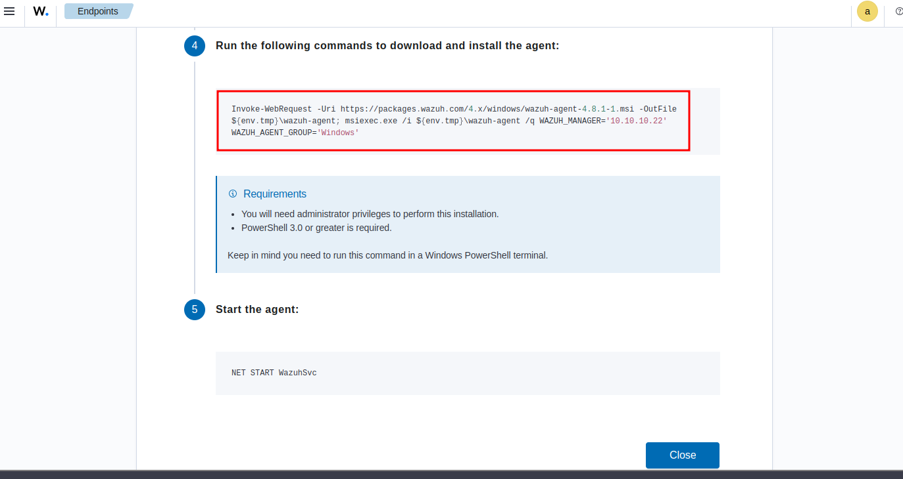

# Wazuh-DFIR-IRIS-Soc-Home-Lab-
This project integrates Wazuh with DFIR-IRIS for case management, providing a unified setup for monitoring and managing security incidents in a SOC environment.

# Project Objectives

1. **Wazuh Deployment**: Successfully install and configure Wazuh in an all-in-one single node deployment on an Ubuntu server.

2. **Agent Installation**: Install and configure the Wazuh agent on a Windows Enterprise system for real-time monitoring.

3. **DFIR-IRIS Setup**: Deploy DFIR-IRIS using Docker to facilitate case management for incident response.

4. **API Integration**: Utilize the DFIR-IRIS API to establish a seamless integration with Wazuh.

5. **Alert Monitoring**: Ensure that Wazuh alerts are correctly received and displayed within the DFIR-IRIS platform for efficient incident handling.

## Installed Wazuh & DFIR-IRIS 

## Configuring Wazuh Agent on Windows-Enterprise

## Integration with DFIR-IRIS

Wazuh has an offcial documentation for integrating with DFIR-IRIS using IRIS API   [Wazuh-DFIR-IRIS](https://wazuh.com/blog/enhancing-incident-response-with-wazuh-and-dfir-iris-integration/)

Obtain IRIS API

### on wazuh server create a  python script

add Wazuh Dashboard IP

Add our iris web-hook url  and API in wazuh-server ossec.conf

## Restart Wazuh-Server and  Check IRIS for Alerts

We received lot's of  alerts from Wazuh in our DFIR-IRIS system. This is due to configuring the Wazuh OSSEC rules at level 3, resulting in a high volume of alerts.
